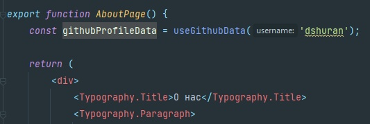

# Заключительный проект
В заключительном проекте мы сделаем сайт, при помощи которого все желающие
смогут выбрать удобные дату и время для стирки и записаться на него.

На сайте будут следующие страницы:
* Главная. Здесь располагается небольшое описание, для чего сайт нужен, а
затем чуть ниже расположена сама форма, где можно записаться на стирку
* О нас. Здесь расположены данные о разработчике, отображаются некоторые данные
из его github-профиля и предоставлен контакт для связи. 
* Далее постепенно будем дорабатывать главную страницу и добавлять на неё новый
функционал. Возможно появление дополнительных страниц - тут зависит от
заказчика (а он может быть непредсказуем)

## Первое домашнее задание

Необходимо:
* Почистить проект, в рамках которого были сданы предыдущие домашние задания,
от старых файлов. Либо создать новое приложение при помощи create-react-app
в вашем репозитории. 
* Создать двухстраничный сайт со страницами "Главная" и "О нас". Навигация по
страницам должна быть реализована при помощи React Router. Важный момент: при
переходе на любую из страниц по её непосредственному адресу в меню должна
подсвечиваться именно эта страница.

## Второе домашнее задание

Необходимо:
* На главной странице необходимо реализовать запись в прачечную. Предыдущее содержимое
  можно удалить. 
* На странице должны быть:
  1. Заголовок и небольшое описание
  2. Форма с двумя или более полями ввода. Необходимые поля: Имя и компонент выбора
  времени на запись.
  3. В компоненте выбора даты должны быть заблокированы для выбора все предыдущие
  дни, чтобы человек случайно не записался на прошедший день
  4. Выбор времени должен производиться в часах-минутах, и для записи должны быть
  доступны только получасовые интервалы (15:00 - 15:30 - 16:00 и т.д)
* По итогу успешного заполнения формы должно быть выведено сообщение об успешной
  записи с указанием времени записи
* Демонстрация результата (как должно быть) будет произведена на занятии

## Третье домашнее задание
Необходимо:
* На странице "О нас" отображать данные из своего github-профиля
  * Как минимум должны быть любые два поля из описания профиля: например,
  имя и биография. Можно указать также и другие данные.
  * Для загрузки данные вам будет необходимо сгенерировать собственный
  токен (https://github.com/settings/tokens/new?scopes=repo)
  * Документация по API пользователей доступна по ссылке
    (https://docs.github.com/en/rest/reference/users#get-a-user)
  * Я использовал [данную](https://github.com/octokit/core.js#readme) библиотеку, предлагаемую разработчиками.
  Вы можете использовать библиотеку на ваш вкус
* Задание можно реализовать при помощи классовых компонентов и при помощи
хуков. В случае использования классовых компонентов максимальная
оценка выполнение задания - 7
* Если решили использовать хуки:
  * Обязательно прочитайте раздел "DATA FETCHING WITH REACT HOOKS" этой
  [статьи](https://www.robinwieruch.de/react-hooks-fetch-data). Иначе вы
    с очень большой вероятностью попадёте в бесконечный цикл и будете долго
    искать проблему
  * Запрос данных с github должен быть вынесен в отдельный хук (см. картинку).
  Единственным аргументом должен быть ваш username
  
  * Хук useGithubData можно объявить в том же файле, что и компонент AboutPage.
  При желании - можно вынести
  